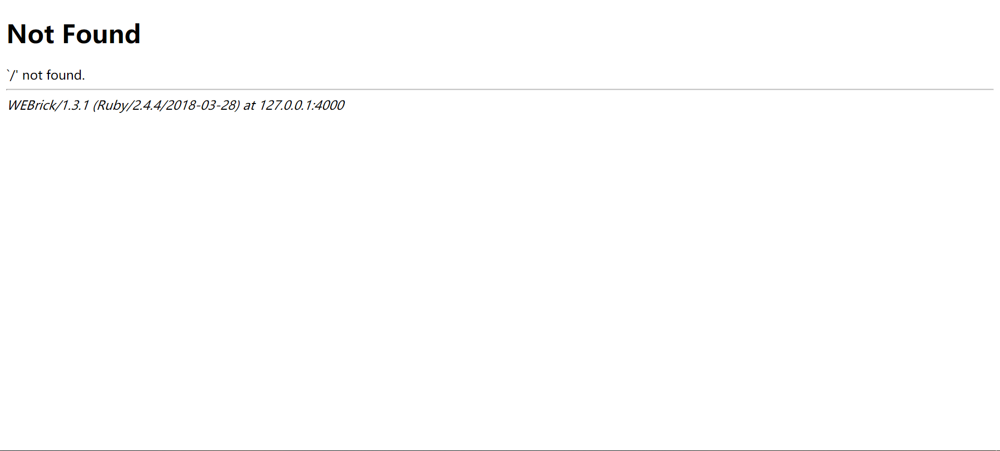
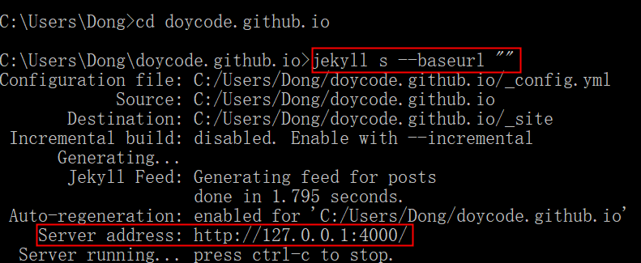

{{ page.title }}
================

<p class="meta">19 Sep 2019 - 杭州</p>

<br>

# 1.前提

本文是记录如何使用 [Jekyll](https://jekyllcn.com/) 对博客进行离线调试，当然前提是 Jekyll 已安装成功，
Windows安装教程请参考 [这里](http://jekyll-windows.juthilo.com/) 或者 [这里](https://www.jianshu.com/p/310d796cf5f3)，且最好能翻墙。


# 2.正文

进入命令行，首先创建一个新文件夹，名字随意，下面的 `doycode.github.io` 是我自己的博客目录：

```bash
jekyll new doycode.github.io
```

然后进入该文件夹：

```bash
cd doycode.github.io
```

接着在预览服务器上构建站点：

```bash
jekyll s
```

成功后在浏览器中输入：`http://127.0.0.1:4000/`，如果出现下图所示错误：

{:height="100%" width="100%"}

这时要看一下生成的 `Server adress`，假如不是 `http://127.0.0.1:4000/`，则需把 `baseurl` 置空：`jekyll s --baseurl ""`，如下图所示：

{:height="100%" width="100%"}

然后编辑新建文件夹中相关内容，在浏览器中实时刷新预览博客效果。

<br>